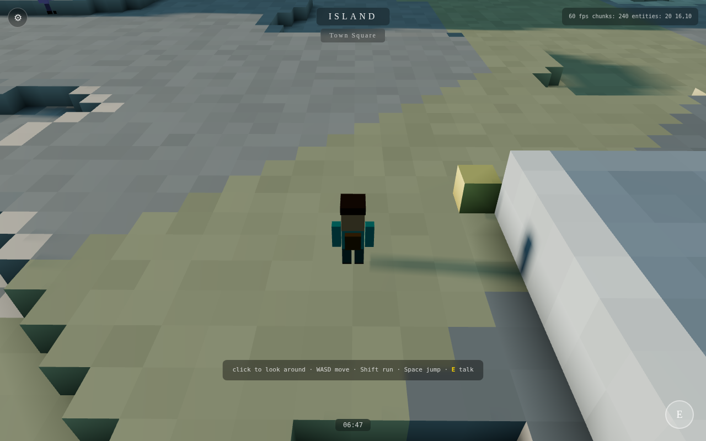

1|# Island Voxel Engine
2|
3|A browser-based voxel game engine built for [Island](https://github.com/Caddickbrown/Island) — a cosy third-person walking simulator in the spirit of Alba: A Wildlife Adventure.


4|
5|## Architecture
6|
7|```
8|engine/
9|  world.js       — Chunk manager, world gen, voxel get/set, dirty tracking
10|  terrain.js     — Heightmap + zone/biome generation (Perlin fbm)
11|  mesher.js      — Chunk mesher with vertex AO + smooth terrain normals
12|  mesher.worker.js — Web Worker wrapper around the mesher
13|  chunkloader.js — Chunk streaming pipeline (worker pool, LOD, dirty re-mesh)
14|  renderer.js    — Three.js scene, chunk mesh lifecycle, pooled lantern lights
15|  player.js      — Third-person controller, physics, collision
16|  entities.js    — Wildlife (seagulls, sheep, deer, whale, boats)
17|  npc.js         — Schedule-driven NPCs with labels and dialogue
18|  water.js       — GPU shader water (no CPU vertex updates)
19|  daynight.js    — Sky, lighting, clouds, time of day
20|  input.js       — Keyboard/mouse/touch/gamepad unified input
21|game/
22|  island.js      — Island world definition, area placement
23|  npcs.js        — Island NPC schedules (ported from Island)
24|index.html       — Entry point
25|```
26|
27|## Design principles
28|
29|- **Chunked** — 32×32×32 voxel chunks. Only mesh chunks within view distance.
30|- **Column-cached worldgen** — heights/biomes computed once per chunk column and
31|  shared by all six vertical slabs; all-air chunks share a single zeroed buffer.
32|- **Frustum culled** — per-mesh bounding spheres, via three.js built-in culling.
33|- **LOD** — near chunks full-res, far chunks silhouette only.
34|- **Worker meshing** — mesh generation off the main thread; empty chunks skipped.
35|- **Shader water** — vertex displacement in GLSL, zero CPU cost per frame.
36|- **Fixed light budget** — a pool of 6 point lights follows the player between
37|  lantern spots at night, so shaders compile once and stay small.
38|- **Alba-scale physics** — gravity, step-up, slope walking. No rigid body solver needed.
39|
40|## Running
41|
42|Serve the repo root over HTTP (workers don't run from `file://`):
43|
44|```
45|npx serve .        # or: python3 -m http.server
46|```
47|
48|then open `index.html`. Three.js is loaded from a CDN import map.
49|
50|## Status
51|
52|🚧 Playable walking sim: streamed island terrain with snow-capped mountain, town
53|and harbour, day/night cycle with clouds and stars, 22 schedule-driven NPCs with
54|dialogue, wildlife, and keyboard/mouse/touch/gamepad input. Start/pause menu
55|(Esc / Start / ⚙) with an invert-camera-Y option, persisted across sessions.
56|