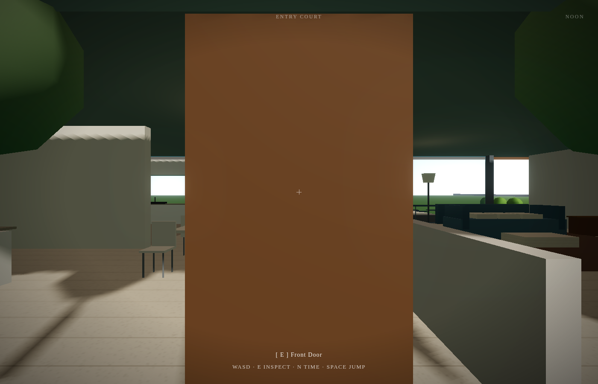

# Pavilion

A single-storey modernist residence. No stairs. No first floor. Every room on the ground, every room with garden access.

The philosophical premise: land is not a constraint. So why build upwards?



## Running

```bash
python3 -m http.server 8905
```

Open `http://localhost:8905` in a browser. Click to enter.

## Controls

| Key | Action |
|-----|--------|
| WASD | Move |
| Mouse | Look |
| Shift | Sprint |
| Space | Jump |
| E | Inspect |
| N | Cycle time of day |
| P | Performance mode |
| Esc | Pause |

## Layout

- **Main pavilion** — open-plan living, dining, kitchen (22×11m, limestone floors, full-height north glazing to garden)
- **Bedroom wing** — glazed link corridor → bedrooms 2+3 → master suite with en-suite (all ground level)
- **Study pavilion** — separate west pavilion, west wall entirely glazed, connected by covered walkway
- **Terrace** — ipe decking between pavilion and pool
- **Lap pool** — 12m, unheated
- **Kitchen garden** — walled, south-east
- **Plot** — ~160×120m, mature trees
