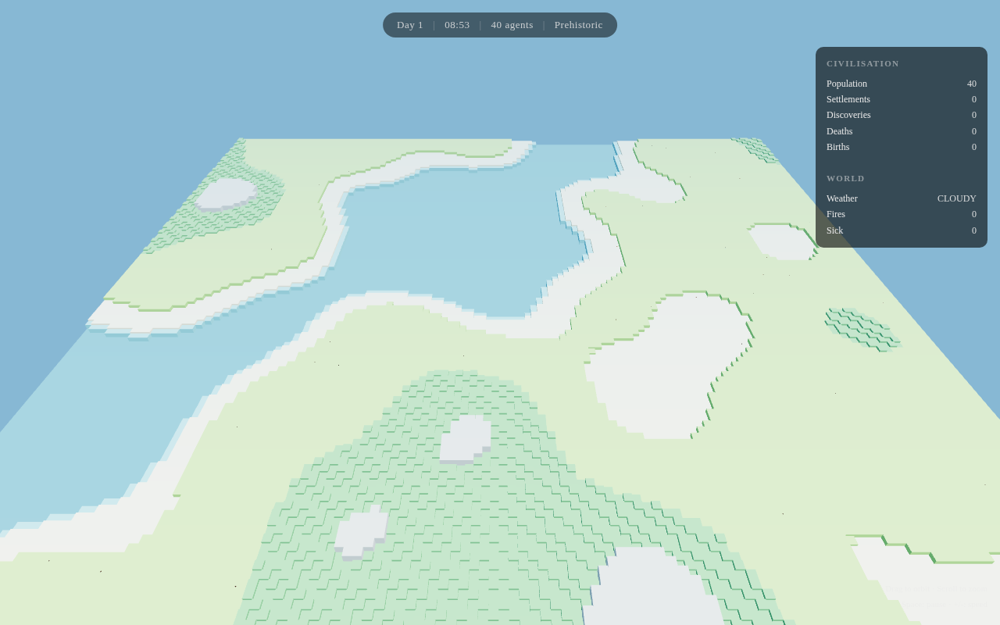

1|# World Voxel
2|
3|A zero-player civilisation simulator rendered in 3D voxels.
4|
5|**World**'s emergent agent simulation (concepts, disease, fire, settlements) running inside **Island Voxel**'s Three.js voxel engine.
6|
7|Watch primitive agents wander a voxel landscape, discover fire, form settlements, fall sick, go to war — all rendered as blocky humanoids on a chunked voxel terrain.


8|
9|## How it works
10|
11|- **Simulation:** World's `SimulationWorker` runs off the main thread — full agent AI, ConceptGraph discovery, DiseaseSystem, FireSystem, SettlementSystem, etc.
12|- **Terrain:** World's 128×128 tile grid converted to a voxel heightmap. Each tile = 4×4 voxel footprint, height from tile elevation and type.
13|- **Agents:** Island Voxel's `buildHumanoid()` blocky character meshes, coloured by agent state, scaled by life stage, animated with walk cycles.
14|- **Observer camera:** No player. Orbit, zoom, and watch civilisation emerge.
15|
16|## Controls
17|
18|| Input | Action |
19||-------|--------|
20|| Drag  | Orbit camera |
21|| Scroll | Zoom |
22|| Space | Pause / unpause |
23|| `+` / `-` | Speed up / slow down simulation |
24|
25|## Running locally
26|
27|```bash
28|python3 -m http.server 8903
29|# open http://localhost:8903
30|```
31|
32|## Credits
33|
34|- Simulation engine: [World](https://github.com/Caddickbrown/World)
35|- Voxel renderer: [Island-Voxel](https://github.com/Caddickbrown/Island-Voxel)
36|