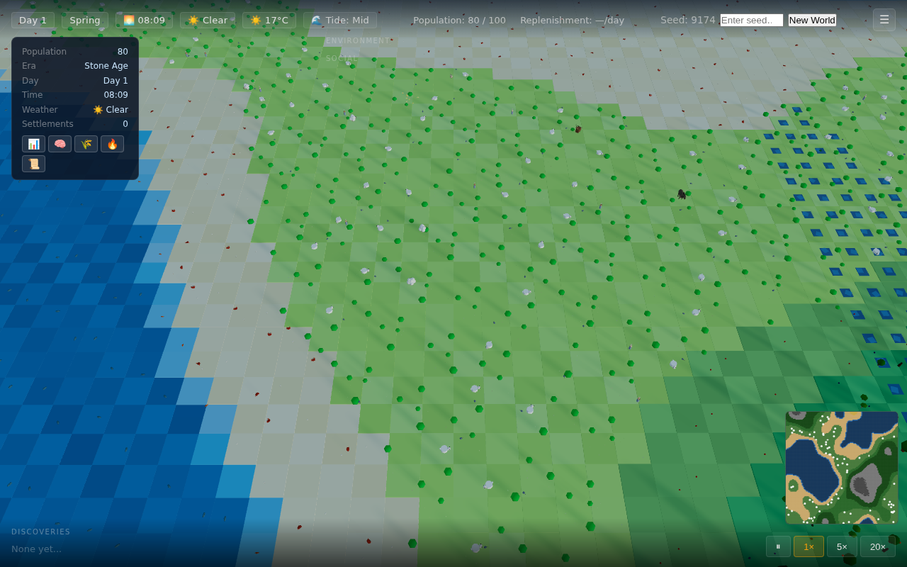

1|# World
2|
3|A passive emergent-civilisation simulator. Watch primitive agents discover fire, language, and society — or fade from the earth.

4|
5|## Running the Game
6|
7|1. Open a terminal in the project directory
8|2. Run: `python -m http.server 8080`
9|3. Open http://localhost:8080 in a modern browser
10|
11|See [guide.html](guide.html) for the full game guide.
12|
13|## Future Features
14|
15|### In Progress
16|- Improved night/day cycle behavior
17|- Fire gives both light and heat
18|- More animals
19|- Animals don't swim unless they're meant to
20|
21|### Simulation Depth
22|- Starvation death — agents die when hunger stays at 0
23|- Disease — infection spreading between nearby agents; Medicine reduces risk
24|- Old-age weakening — slower movement/gathering near max age
25|- Natural disasters — droughts, floods, blights affecting tiles or food
26|- Seasonal migration — agents (or animals) moving toward better tiles in winter
27|
28|### World & Environment
29|- Save/load — persist world, agents, discoveries
30|- Multiple biomes — deserts, swamps, tundra with different rules
31|- Rivers — flowing water tiles; crossings require Rope or bridge concept
32|- Caves — shelter from weather, early discovery hotspots
33|- Resource depletion feedback — tiles slowly degrading (overgrazed grass → barren)
34|
35|### Animals & Hunting
36|- Huntable wildlife — Hunting concept actually removes animals for meat
37|- Predators — wolves/bears that can kill weak agents
38|- Animal populations — reproduction, migration, extinction
39|- Domestication feedback — tamed animals that provide food or labour
40|
41|### Society & Concepts
42|- Era 3+ — philosophy, governance, trade
43|- Conflict — rival groups or warfare at higher population
44|- Visible buildings — houses, workshops, shrines from Housing/Shelter concepts
45|- Trade — agents exchanging food or resources
46|- Religion/culture — beliefs that spread and influence behaviour
47|
48|### UX & Polish
49|- Mini-map — overview of terrain and settlements
50|- Timeline/history — scrollable log of discoveries and major events
51|- Achievements — "Survive 100 days", "Discover all Era 1 concepts"
52|- World seed input — replay or share specific worlds
53|- Replay mode — watch a past run from save data
54|
55|### Technical
56|- Web Workers — simulation runs off main thread for larger populations
57|- Progressive Web App — installable, offline-capable
58|- Mobile support — touch controls and streamlined UI
59|